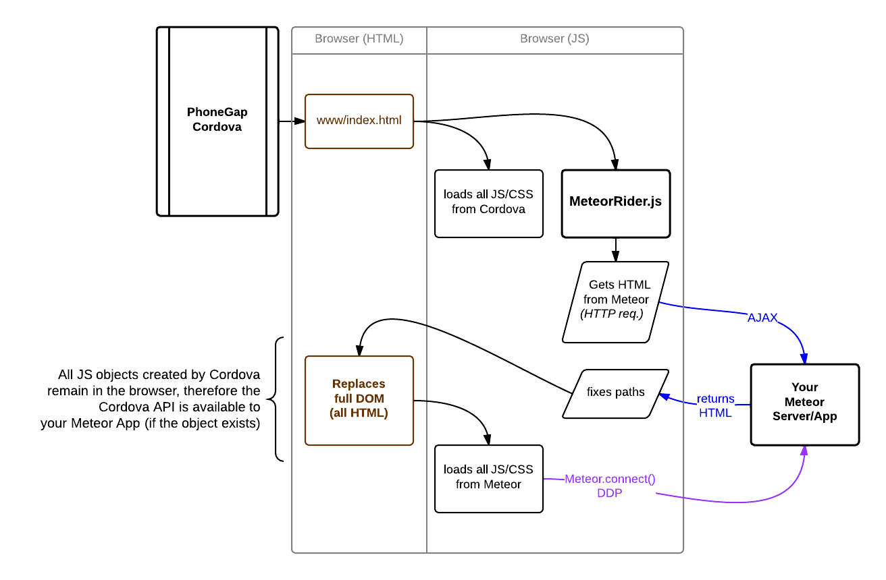

# MeteorRider

An approach for integrating [PhoneGap/Cordova](http://phonegap.com/) + [Meteor](https://www.meteor.com/).

*Your Meteor web app (real time everything), inside a Cordova shell (native APIs) = awesome!*

# How it works

* Cordova loads it's normal, compiled `www/index.html`
 * All normal, compiled Cordova JS loads *(this ensures Cordova API versions are maintained, decoupled from Meteor)*
* MeteorRider
 * **Step 1) loading**
  * MeteorRider looks in localStorage to see if we have cached the last requested HTML
 * **Step 2) requesting**
  * MeteorRider does an AJAX request to your Meteor Server
  * MeteorRider replaces paths in the HTML response to be full URLs
 * **(Step 3) replacing**
  * MeteorRider **replaces** the DOM *("hijacking the DOM")*
  * MeteorRider stores the HTML for next time's loading screen
* The DOM loads all the Meteor JS/CSS
 * *NOTE that all of Cordova's JS remains in the DOM (from before)*
 * *future-feature: planning on caching and inlining this*
* Meteor connects via DDP to the Meteor Server



## It's Easy

It might sound a bit complex, but really it's pretty simple.

This approach is good for the following reasons

* The JS needed for whatever version of Cordova is always bundled with Cordova,
  updating is easy.
* All Cordova API and Plugins' remain available, because the Cordova JS is
  loaded first, we just add to it.
* Once setup you can mostly ignore Cordova and only update your Meteor app, all
  updates get to the client FAST (no app updating needed)
* iframes are the devil!

If you want an alternative, without the extra AJAX request try out

* [Pack Meteor](https://github.com/SpaceCapsule/packmeteor) is a great way to
  compile all of what you need to run meteor (client) on [Chrome Packaged Apps for Mobile](https://github.com/MobileChromeApps/mobile-chrome-apps) (etc)
 * upside: super-fast, all Meteor assets live local in the Mobile App
 * upside: build script gets all Meteor JS & assets *(well managed)*
 * upside: chrome APIs available if you do [Chrome Packaged Apps for Mobile](https://github.com/MobileChromeApps/mobile-chrome-apps)
 * upside: decent "offline" support
 * downside: slightly more complicated release proccess
 * downside: you have to re-release the mobile application for every update to your Meteor App
 * downside: you have coordinate your entire user base's apps for releases if your app changes (since they have an old version installed)
* [Meteor Cordova Loader](https://github.com/andrewreedy/meteor-cordova-loader) is another great alternative, basically a super-lazy-loader option
 * upside: faster initial load, no Cordova initial load screen
 * upside: load script gets all Cordova core & plugin JS from Meteor *(well managed)*
 * downside: you can [basically never update versions of Cordova after release](https://github.com/andrewreedy/meteor-cordova-loader/issues/16) because client versions are unknown
 * downside: like above, you can never add or upgrade a plugin for the same reasons, the client "version" is lost
 * downside: no "offline" support *(though, MeteorRider doesn't offer much for that either)*

For more info, [a comparison of approaches](http://zeroasterisk.com/2013/08/22/meteor-phonegapcordova-roundup-fall-2013/)

## Example Projects

* https://github.com/zeroasterisk/MeteorRiderExample0 Cordova 3.5 Android (2 commits)
 * This is a very basic example, showing how easy it is to implement
 * You can edit the URL to the Meteor App and this will work as a totally functional shell for your app
 * You can add platforms like *iOS* in the normal Cordova way and be up and working on them in seconds
* https://github.com/zeroasterisk/MeteorRiderExample-CrossWalk CrossWalk + Cordova 3.5 ~ Android (1 commit)
 * **Did you know?** [CrossWalk](https://crosswalk-project.org/#documentation/cordova) is the project behind
   [Chrome Packaged Apps for Mobile](https://github.com/MobileChromeApps/mobile-chrome-apps), 
   taking **Chromium** to the mobile device *(so you aren't stuck with old-ass-WebKit on Android)*
 * this is definitely my recommendation for performance on Android
 * You can edit the URL to the Meteor App and this will work as a totally functional shell for your app
 * Only Android :(

## Installation / Usage

> NPM installer package under consideration see
> [this npm package](https://github.com/poetic/meteor-rider) and
> [this discussion](https://github.com/zeroasterisk/MeteorRider/pull/20)

There are only a couple of files, and you can choose to manage them however you like...

### Get the Code

```
cd tmp
git clone https://github.com/zeroasterisk/MeteorRider.git MeteorRider
```

----

## On PhoneGap/Cordova - Setup


### Option 1) Replace the whole index.html file

You do not have to replace the whole `index.html` file, but it's a reasonable "fast start".

* `www/js/meteor-rider.js` is our tool for getting the Meteor HTML and taking over the DOM
* `www/js/phonegapapp.js` is where you setup your application and initializer for MeteorRider
 * has a basic structure for handling events and firing up MeteorRider
 * has a stub for a test switcher, to bypass loading MeteorRider for testing on device only
 * *you can override any of this*

```
cd pathtoyourphonegap/assets/www/
cp index.html index_old.html
cp /tmp/MeteorRider/www/index.html index.html
cp /tmp/MeteorRider/www/js/meteor-rider.js js/
```

Then edit `index.html` with the appropriate **config** (see Configuration)

### Option 2) Edit the index.html file

There is very little that is "required" to fire up MeteorRider.

This is the minimum you want in your `index.html`

        <script type="text/javascript" src="js/meteor-rider.js"></script>
        <script type="text/javascript">
          document.addEventListener('deviceready', function() {
              MeteorRider.init("http://leaderboard.meteor.com/");
          }, false);
        </script>

You just need to call `MeteorRider.init()` when the `deviceready` Event is triggered.

### MeteorRider.config 

Here is the default config

    config: {
      meteorUrl: '',
      currentPath: '',
      localStorage: true,
      // step 1) loading text
      doLoading: true,
      // step 2) AJAX request
      doRequest: true,
      // step 3) AJAX response (or cache) replacing DOM
      doReplace: true
    },

If this is global variable is found, it sets the default config in MeteorRider

    var __MeteorRiderConfig__ = {
      meteorUrl:  "http://leaderboard.meteor.com/",
      currentPath: "/",
      localStorage: true
    };

You can pass any part of the `config` into `MeteorRider.init()` like so:

    MeteorRider.init({ meteorUrl: "http://leaderboard.meteor.com/", localStorage: false });

You can also just pass in a string, and it will be treated like the meteorUrl *(simplest config)*

    MeteorRider.init("http://leaderboard.meteor.com/");

#### MeteorRider.config.meteorUrl (required)

Set the `meteorUrl` property, it should be the full URL to your meteor app.

> NOTE: full public URLs work best.
> Localhost or internal IPs probably wont work.
> If Cordova can't load it, it won't work.

----

## On Meteor

You do not have to put anything in Meteor, but if you copy in this `startup.js` file, it will handle *hot code pushes* and reload inside PhoneGap/Cordova, without losing the phonegap context.

```
cd pathtoyourmeteorapp
cp /tmp/MeteorRider/meteor/startup.js startup.js
```

Obviously, the best bet is to look for the the Cordova APIs directly

```
if (_.isObject(device)) {
  console.log(device.cordova);
}
```

You can also look for the `MeteorRider` JS object inside your Meteor app and use it as a means of basic knowledge about the client, and status.

You can also force the `localStorage` to be the "loading" screen on the next
pageload... (it should be the full HTML you want rendered)

```
MeteorRider.meteorHtml = '<!DOCTYPE html><html><head>' +
  '<link rel="stylesheet" href="http://leaderboard.meteor.com/6a545450449411b537bd96111c640ce7d7a1092e.css">' +
  '<script type="text/javascript" src="http://leaderboard.meteor.com/9ebe61ab3cb3e1d4bcd16191207b9f1eb692d512.js"></script>' +
  '</head><body>' +
    'My Cool Loading Content Here :)' +
  '</body></html>';

MeteorRider.replaceStoreHtml();
```

----

## Meteor Packages for PhoneGap/Cordova

There are probably many more than this list, [let me know about `em](https://twitter.com/zeroasterisk).

### OAuth for Meteor + MeteorRider + PhoneGap/Cordova

Sadly this should "just work" out-of-the-box, but as of now, it is 
[frought](https://github.com/AdamBrodzinski/meteor-phonegap-oauth/pull/5)
with
[peril](https://github.com/zeroasterisk/MeteorRider/issues/16).

Luckily there is an excellent project alive which is a very easy `mrt add phonegap-oauth` away. 

Check it out here [meteor-phonegap-oauth](https://github.com/AdamBrodzinski/meteor-phonegap-oauth)


----

## Common Problems / Tips

**PhoneGap/Cordova Issues? Plugin Issues?**

1. Stop `MeteorRider` (comment it out, or setup testing conditional bypass)
2. Run whatever you're doing with just `index.html` and "on device" JS (without Meteor)
3. Working locally but not with MeteorRider?  Enable MeteorRider again and look for a namespace collision...

**Not Loading Meteor?**

1. Check the URL, can Cordova get to it?
2. Try loading a static file from your Meteor URL (from the `/public/` folder) as the `meteorUrl`.
3. Check the console from Cordova (Android, iOS, etc)

    MeteorRider requesting
    MeteorRider url: http://example.com
    MeteorRider response.status = 404

You can uncomment the lines in MeteorRider where it logs the `meteorHtml`
  (the HTML content from Meteor).


### PhoneGap/Cordova needs to be setup to allow access to Meteor

In older PhoneGap installs or if you've restrictred `<access>`, may have to allow access to the Meteor app url/domain.  Refer to the configuration documentation for your version of PhoneGap.

http://docs.phonegap.com/en/edge/guide_appdev_security_index.md.html#Security%20Guide

```
<access origin="*" />
```


In the Wild
--------------

* http://blonk.co/
 * https://www.discovermeteor.com/blog/blonk-building-tinder-for-jobs-with-meteor-for-mobile/
* http://grigio.org/meteor_and_phonegap_cordova_3_x_build_native_app_android_and_ios
* http://meteorpedia.org/read/Mobile_support
* ??

Roadmap / Goals
--------------

The main goal is to provide a simple, fast, and standardized way to connect
PhoneGap to Meteor.

The combination is very powerful, and I have high hope for the future.

Goals:

* PhoneGap version agnostic *(done)*
* Meteor version agnostic *(mostly done)*
* Device agnostic *(maybe done ? Android and iOS only ones experiemented with)*
* Minimal configuration / setup *(done)*
* Package installer

Tasks:

* invesigate loading just the HEAD data from the AJAX reques
* invesigate loading the JS files (from Meteor) via AJAX so that we know when completed and could trigger callbacks
* implement a warning/alerting system for device/connection state (PhoneGap version dependancies?)
* we may provide a means of setting up an "offline" page

Authors / Acknowledgements
--------------

This is the "Option 3" approach I've been thinking about for a while.

Inspiration and collaboration from:

* [Abigail](https://github.com/awatson1978): https://github.com/awatson1978/cordova-phonegap
* [Morten](https://github.com/raix): https://github.com/raix/Meteor-Cordova
* And [pull requests](https://github.com/zeroasterisk/MeteorRider/pulls?direction=desc&page=1&sort=created&state=closed) from
 * [Daniel](https://github.com/DanyHunter)
 * [@cdoe](https://github.com/cdoe)
 * [Guillaume](https://github.com/silently)
 * [Marc](https://github.com/marbemac)

I'd like to thank all of them for communicating with me while figuring out what my
options were and for collaboration on this project.

Background:

http://prezi.com/ig9gjm11mwsi/from-zero-to-mobile-web-app-in-sixty-minutes/

http://zeroasterisk.com/2013/08/22/meteor-phonegapcordova-roundup-fall-2013/
